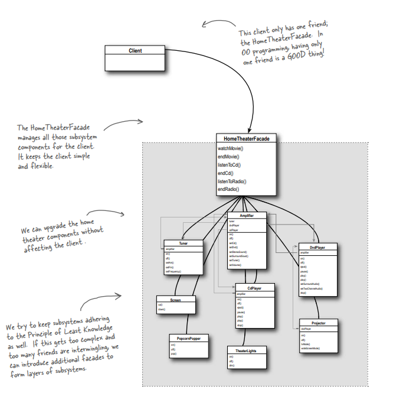
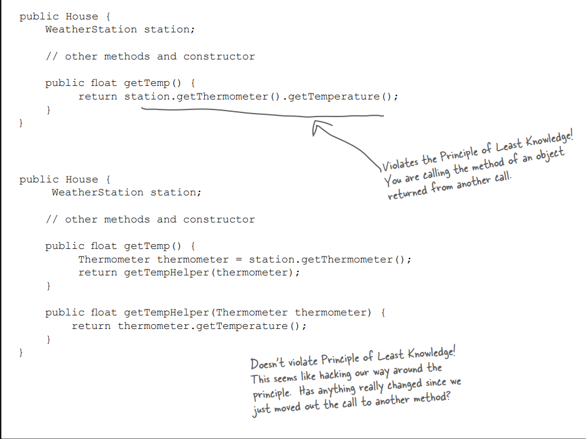
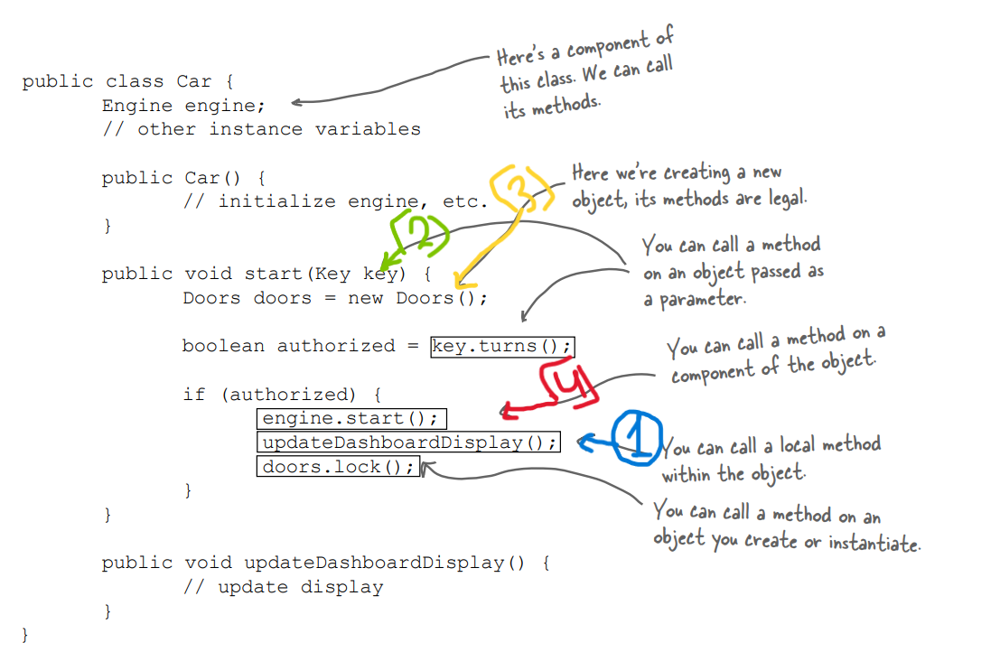

# Facade Design Pattern

## Definition:

The Facade Pattern provides a unified interface to a set of interfaces in a subsystem. Facade defines a higher level interface that makes the subsystem easier to use. 

## when to use?

-- Giving simple interface for complex system/subsystem. 
-- Good in isolation(Changes does not affect client). 
-- We can have more than one facade for a single system. 

## The UML diagram for the Command Pattern is shown below:

## Some notes about this pattern:

-- When you need to simplify and unify a large interface or complex set of interfaces, use a facade. 
-- A facade decouples a client from a complex subsystem. 
-- Implementing a facade requires that we compose the facade with its subsystem and use delegation to perform the work of the facade. 
-- A facade wraps a set of objects to simplify. 

## some principles about this pattern:

-- Principle of Least Knowledge ==> Only talk to your friends(That statement means that the client communicates with the facade, which acts as a friend for the client).

### Please take a look at this image to understand what I mean:

### The principle tells us that we should only invoke methods that belong to:

1. The object itself
2. Objects passed in as a parameter to the method
3. Any object the method creates or instantiates
4. Any components of the object

### let us take example to clarify this principle:

