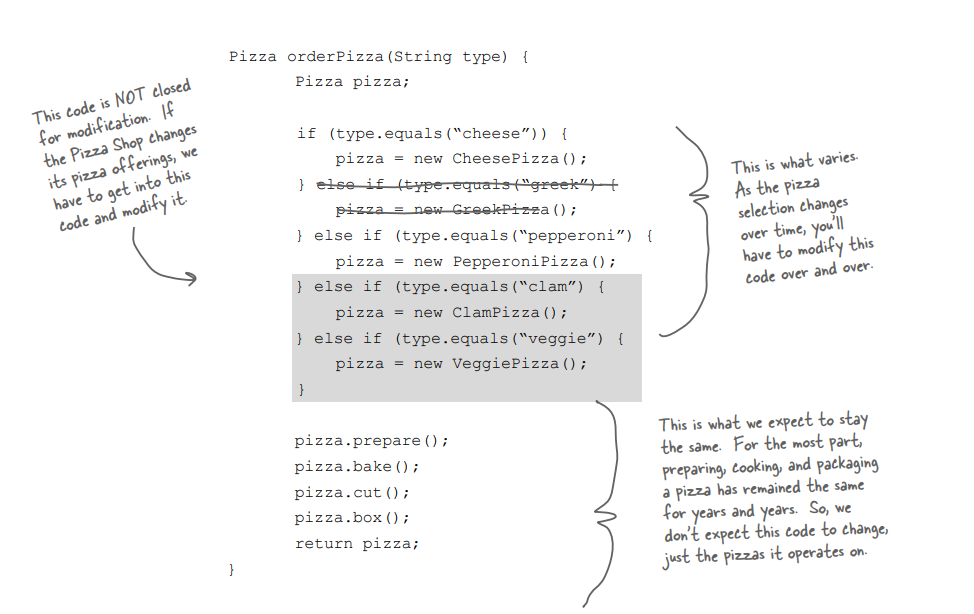
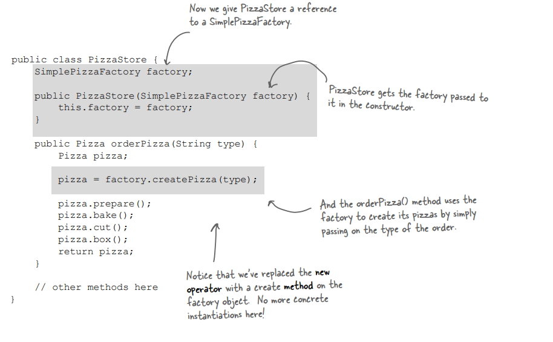
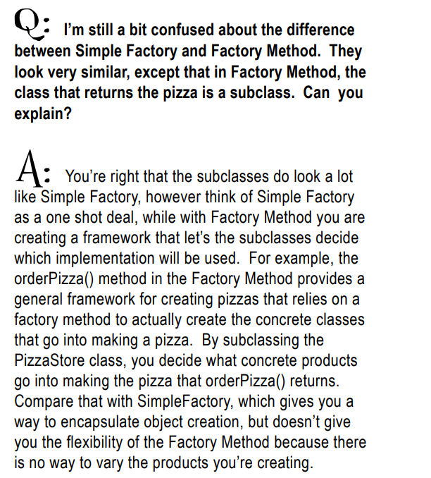
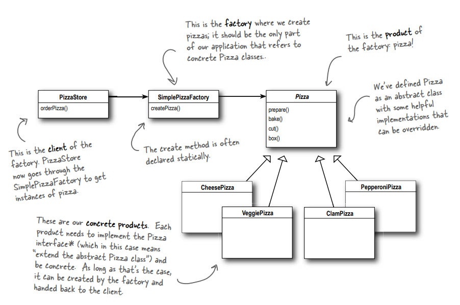
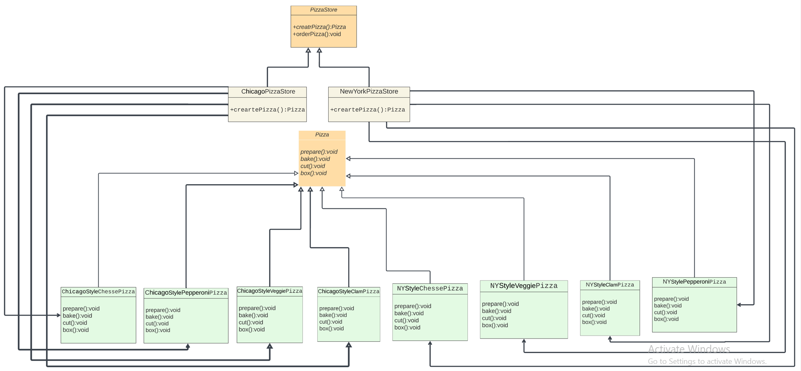
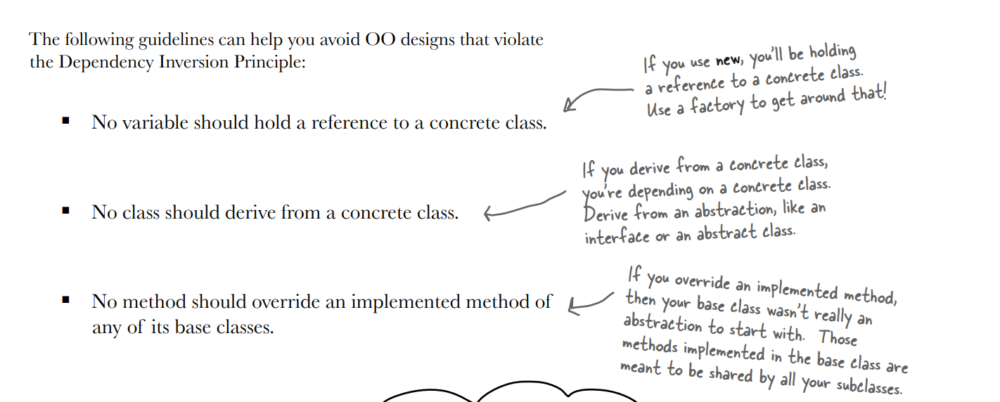

# Simple Factory And Factory Method

## Definition of Factory Method:

Define an interface for creating an object, but let subclasses decide
which class to instantiate. Factory Method lets a class defer instantiation to the subclasses.

## The reason to use factory method:

This pattern encapsulate object creation
and lead to more decoupled, flexible designs.

## The Problem that forced us to use factory method:

Let's consider a pizza store where we offer a variety of pizza types, including cheese, Greek, clam, and veggie. We also have a method called orderPizza(). Based on the customer's order, we create an object representing the specific type of pizza that the customer has requested.

Till now no problem.

If we introduce new types of pizza into the system, we may need to modify the orderPizza() method. This situation raises concerns related to the Open-Closed Principle (OCP), as it violates the principle by requiring us to make changes to the existing code.

A solution to this problem is to implement a factory method that contains different types of pizza and can create objects based on the selected pizza type. This method will return the corresponding pizza object.

So factory method encapsulate object creation
and lead to more decoupled, flexible designs.

### The code with the problem is located in the orderPizza() method, where there is an issue with handling new pizza types or delete old pizza type.

### "The code after solving this problem will:

## Some notes about this pattern:

-- All factories encapsulate object creation. 
-- Simple Factory, while not a bona fide design pattern, is a simple way to decouple your clients from concrete classes. 
-- Factory Method relies on inheritance: object creation is
delegated to subclasses which implement the factory method to
create objects. 
-- All factory patterns promote loose coupling by reducing the
dependency of your application on concrete classes. 
-- The intent of Factory Method is to allow a class to defer
instantiation to its subclasses. 
-- The Dependency Inversion Principle guides us to avoid
dependencies on concrete types and to strive for abstractions. 
-- Factories are a powerful technique for coding to
abstractions, not concrete classes. 

## some principles about this pattern:

Factory Method Depend on abstraction.Do not
depend on concrete classes.

## We have two types of factories:

### 1)Simple factory

### 2)Method factory

## let us talk about difference between simple factory and method factory:

So, the difference between them is that a simple factory is a concrete class (a class that has factory method), whereas a method factory implements an abstract class (creator).

## Let's take an example(Pizza Store) of the factory method(simple factory):

### UML Diagram:

### Details About PizzaStore:

-- We have a class named PizzaStore that instantiates an object of PizzaSimpleFactory. Within this class, there's a method called createOrder(String type). In this method, we create a new object based on the type of pizza the customer has ordered. We then return this object to pizzaOrder() and proceed to call the prepare, bake, cut, and box methods.
-- We have a PizzaSimpleFactory class that contains all types of pizza, allowing us to modify the class by adding or deleting different kinds of pizza as needed.
-- we have abstract class pizza that has methods prepare, bake, cut and box.
-- We have various pizza types that extend the Pizza class and override all of its methods in their respective classes.

## Let's take an example(Pizza Store) of the factory method(factory method):

### UML Diagram:

### Details About Pizza store using the factory method:

-- We have an abstract class named PizzaStore that has two methods: orderPizza() (concrete) and createPizza() (an abstract method that is overridden in classes that extend from PizzaStore). Within this class, there's a method called createOrder(String type). In this method, we create a new object based on the type of pizza the customer has ordered. We then return this object to pizza Object pizzaOrder() and proceed to call the prepare, bake, cut, and box methods.
-- We offer two styles: New York style and Chicago style, which extend from the PizzaStore class and override the createMethod() function.
-- Each style has different various pizza types (cheese, pepperoni, clam and veggie).
-- we have abstract class pizza that has methods prepare, bake, cut and box.
-- We have various pizza types that extend the Pizza class and override all of its methods in their respective classes.

## How to avoid OO Designs that violate the Dependency Inversion Principle?

