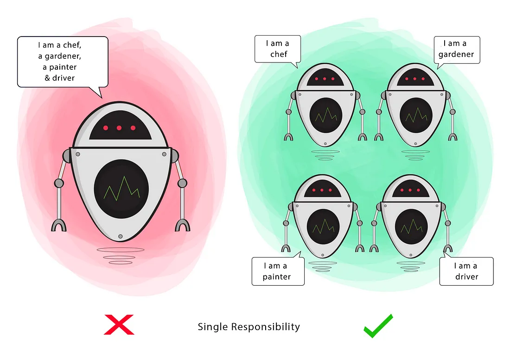
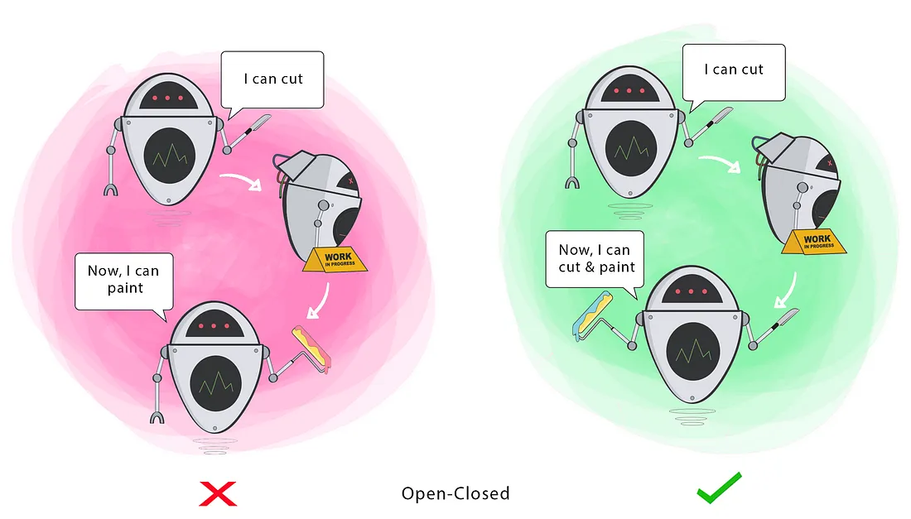
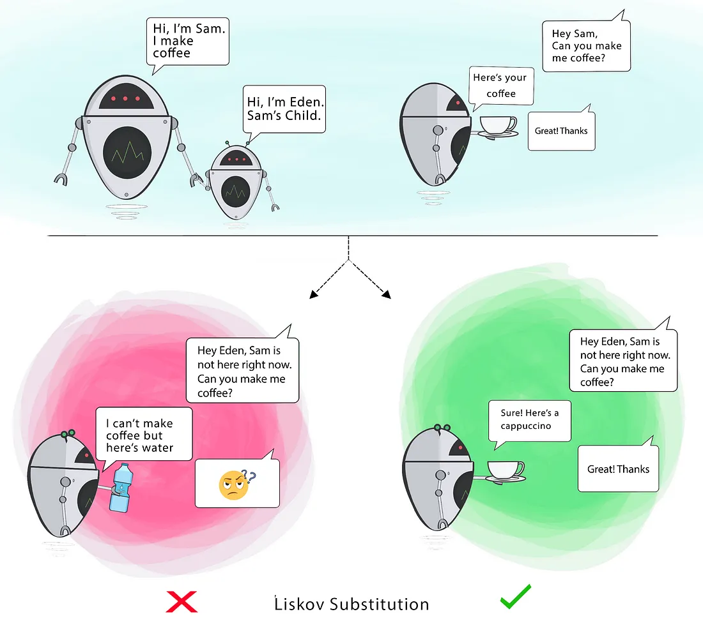
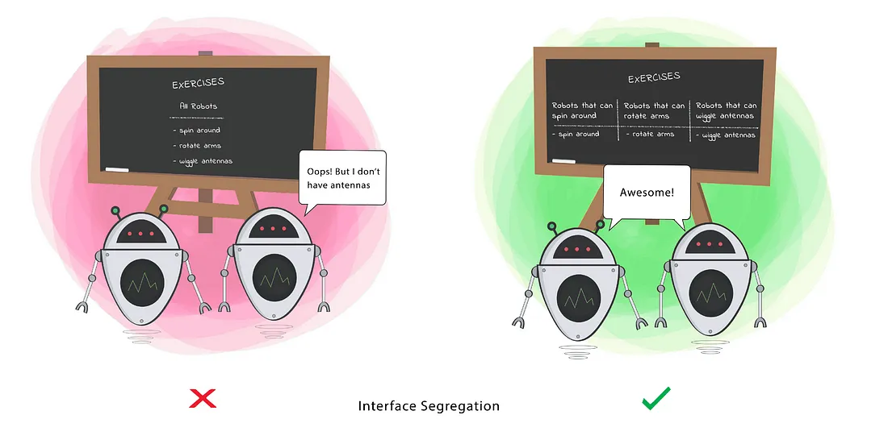
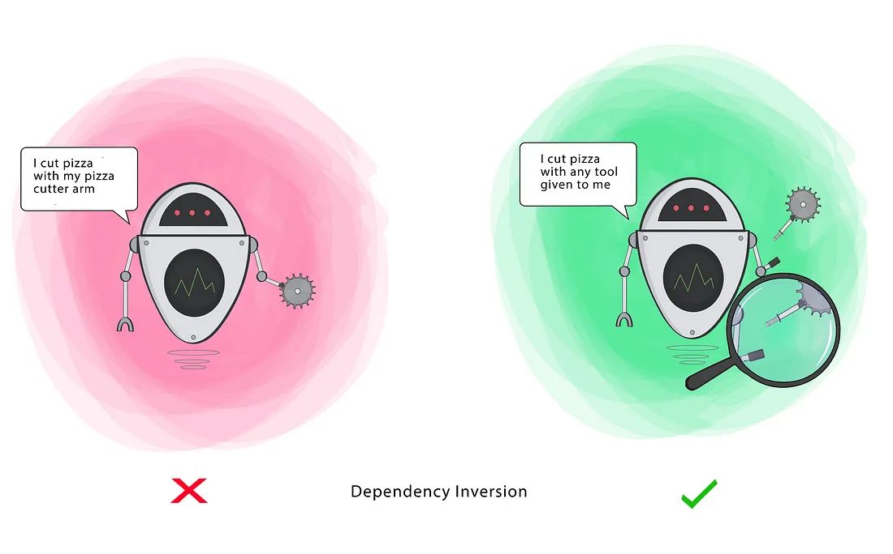

# AdvancedSoftware

## Single responsibility principle

A class should have only one reason to change. This principle states that a class should have a single responsibility or purpose. It should encapsulate one and only one functionality or concept. By adhering to this principle, you ensure that a class has a clear and well-defined role, making it easier to understand, test, and modify.

## Open Close principle

Software entities (classes, modules, functions, etc.) should be open for extension but closed for modification. This principle emphasizes that you should design your code in a way that allows new functionality to be added without modifying existing code. This is typically achieved through the use of abstraction, interfaces, and inheritance, enabling you to extend the behavior of a system without altering its existing implementation.

## LiskovSubstitutionPrinciple

Subtypes must be substitutable for their base types. This principle states that objects of a superclass should be replaceable with objects of its subclasses without affecting the correctness of the program. In other words, subclasses should be able to extend or specialize the behavior of the superclass without breaking the code that relies on the superclass. This principle ensures that inheritance hierarchies are well-designed and that polymorphism can be safely applied.

## InterfaceSegregationPrinciple

the interface segregation principle (ISP) states that no code should be forced to depend on methods it does not use. ISP splits interfaces that are very large into smaller and more specific ones so that clients will only have to know about the methods that are of interest to them

## Dependency Inversion Principle

The dependency inversion principle states that high-level modules should depend on abstractions rather than low-level modules. This helps to decouple the components in your application and can make your code more flexible, maintainable, and easier to test.

